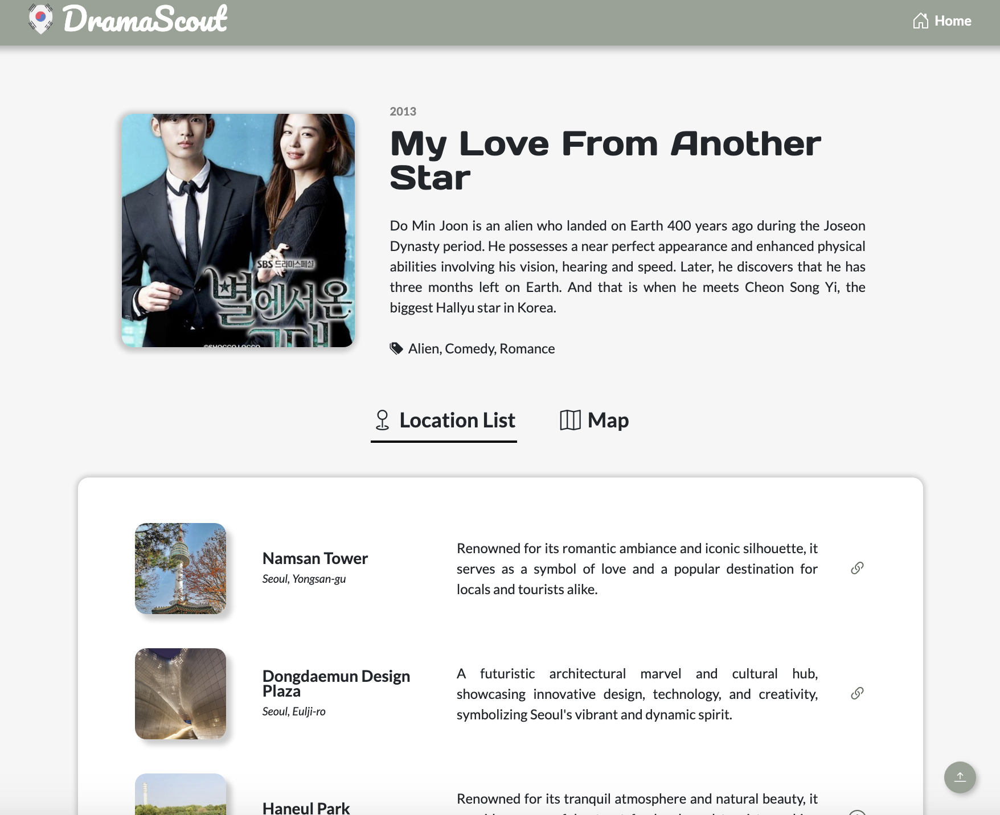
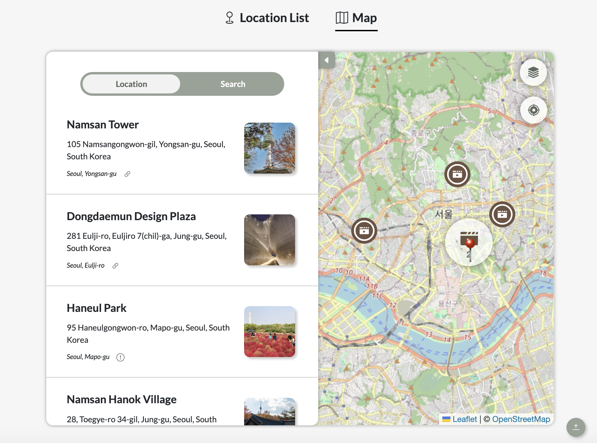
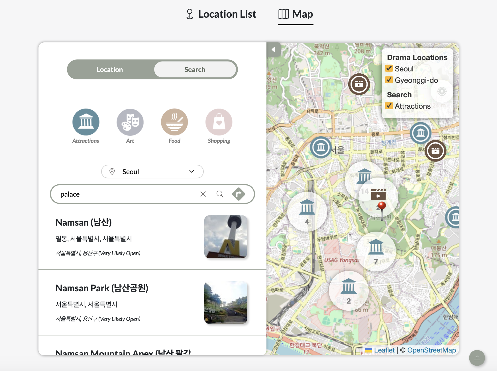
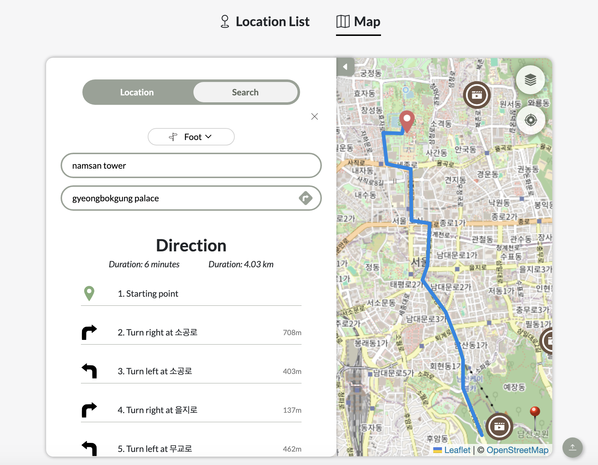
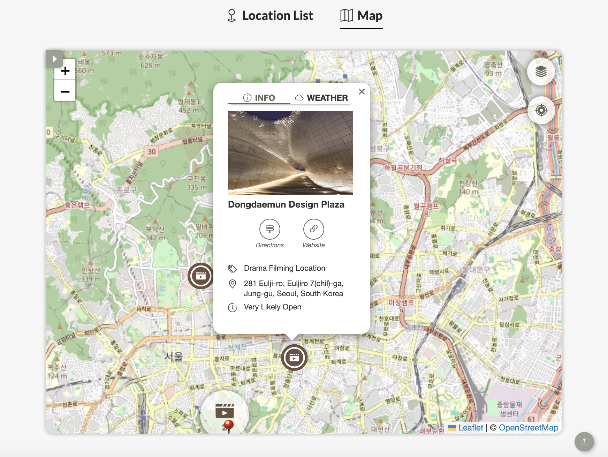
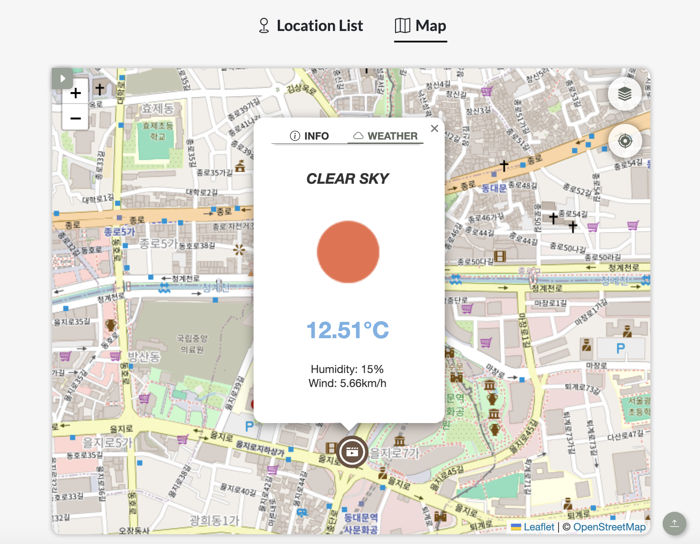

# DramaScount

Welcome to DramaScount, your ultimate guide to exploring South Korea through the lens of popular drama filming locations! DramaScount is a website designed to enhance the tourist experience by compiling and mapping out the iconic filming spots of your favorite Korean dramas. With our innovative features, users can seamlessly navigate through the vibrant landscapes and immerse themselves in the captivating narratives of their beloved dramas.

## Possible Users

- **Tourists Visiting South Korea:** Whether you're a K-drama enthusiast or simply looking to explore the picturesque filming locations, DramaScount is tailored to enhance your travel experience.
- **Fans of Korean Dramas:** If you've ever dreamed of stepping into the scenes of your favorite dramas, DramaScount is your virtual guide to making those dreams a reality.
- **Travel Enthusiasts:** For those seeking unique and memorable travel experiences, DramaScount offers a novel way to discover the beauty and charm of South Korea.

[Back to Top](#dramascount)

## Users' Primary Problems and Pain Points

- **Difficulty in Locating Filming Locations:** Traditional travel resources may not provide comprehensive information about the filming locations of Korean dramas, making it challenging for fans to visit these sites.
- **Lack of Customized Search Options:** Tourists often struggle to find attractions and amenities near their desired locations, leading to inefficient planning and exploration.
- **Limited Access to Real-Time Weather Information:** Weather conditions can greatly impact travel plans, yet accessing up-to-date weather forecasts for specific locations may be cumbersome.

[Back to Top](#dramascount)

## Project Description

## 1. Home Page
The home page features a curated list of popular Korean dramas, making it easy for users to discover new favorites.

## 2. Drama Detail Page
Clicking on a drama card takes users to a detailed page showcasing the filming locations of the drama along with brief descriptions of these places.

## 3. Map Functionality
Within the drama detail page, users can navigate to the map tab, which presents an interactive map plotting the filming locations. Key functionalities of the map include:
- **Place Search:** Users can search for specific places, and the map will plot the results.
- **Weather Information:** Each location popup on the map includes information about the place and displays the current weather conditions.
- **Direction Search:** Users can find the route between two desired locations, enhancing their exploration experience.

### Screenshots

*Home Page: Explore a curated list of popular Korean dramas.*

*Drama Detail Page: Discover filming locations and descriptions.*

*Map Tab: Explore filming locations on an interactive map with search and direction functionalities.*

*Place Search: Search for places you like to visit based on the category type (attractions, art, food, shopping) within the preferred province*

*Direction: Search for a recommended route between 2 locations.*

*Place Detail: Retrieve details of place of interest and view the current weather condition.*

[Back to Top](#dramascount)

## Technologies Used

- **HTML**
- **CSS**
- **JavaScript**
- **Leaflet.js:** For interactive mapping functionality.
- **Foursquare API:** For retrieving venue information and photos.
- **OSRM (Open Source Routing Machine):** For recommended travel route between locations.
- **OpenWeather API:** For accessing real-time weather information.

[Back to Top](#dramascount)

## Acknowledgments

This project acknowledges the following technologies and APIs:

- [Bootstrap Icons](https://icons.getbootstrap.com/)
- [Leaflet.js](https://leafletjs.com/)
- [Foursquare API](https://developer.foursquare.com/)
- [OSRM API](https://project-osrm.org/docs/v5.5.1/api/#general-options)
- [OSRM Nominatim](https://nominatim.org/release-docs/latest/api/Overview/)
- [OpenWeather API](https://openweathermap.org/api)

Click on the links above to access the respective documentation or information about each technology or API.

[Back to Top](#dramascount)